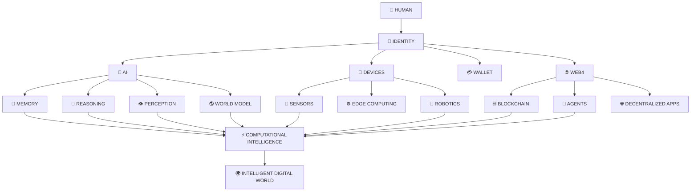

<div align="center">

# 🌐 QUBUHUB

### **Open Web4 Intelligence Ecosystem**

**AI · Web4 · Blockchain · Software · Research**

<br/>


<br/><br/>

> **Build intelligence. Connect identity. Program the future.**

</div>

---

## 🧠 What is QUBUHUB?

**QUBUHUB** is an open technology ecosystem exploring the convergence of:

```text
Artificial Intelligence
        +
Web4 Infrastructure
        +
Digital Identity
        +
Blockchain
        +
Programming Languages
        +
Intelligent Data
        +
Robotics
        +
Distributed Computing
        ↓
   COMPUTATIONAL
    INTELLIGENCE
```

We build experimental and production-oriented systems across the entire stack — from **programming languages and runtimes** to **AI agents, intelligent data systems, identity infrastructure, and embodied computing**.

---

## ⚡ The QUBUHUB Stack

<div align="center">



</div>

---

## 🚀 Core Domains

<table>
<tr>
<td width="50%">

### 🤖 Artificial Intelligence

* Multimodal AI
* AI agents
* Reasoning systems
* Computer vision
* Generative AI
* Memory architectures
* World models
* Explainable AI

</td>
<td width="50%">

### 🌐 Web4

* Digital identity
* Agent identity
* Device identity
* Wallet infrastructure
* Decentralized applications
* Human ↔ machine networks
* Cryptographic trust

</td>
</tr>

<tr>
<td>

### 🧬 Computational Systems

* Programming languages
* Compiler engineering
* Runtimes
* Virtual machines
* WebAssembly
* Intelligent data systems
* Scientific computing

</td>
<td>

### 🦾 Embodied Intelligence

* Robotics
* Edge AI
* Computer vision
* Sensor fusion
* Embedded systems
* Autonomous systems
* Human-machine interaction

</td>
</tr>
</table>

---

# 🧩 Featured Projects

<div align="center">

|       Project      |       Domain      | Purpose                                         |
| :----------------: | :---------------: | :---------------------------------------------- |
|     🧠 **LMLM**    |         AI        | Large Multifunctional Local Model               |
|    ⚡ **Voltron**   | AI / World Models | BrainWorld computational architecture           |
| 🩻 **OmniSkel-AI** |     Medical AI    | Multimodal medical-imaging intelligence         |
|    🧪 **APLCE**    |     Languages     | Programming languages & compiler engineering    |
|   📊 **AuraXLSL**  |     Computing     | Intelligent Spreadsheet Language                |
|   🤖 **Neomind**   |      Robotics     | Embedded intelligent systems                    |
|     🌐 **Web4**    |        Web4       | Identity, agents & decentralized infrastructure |

</div>

---

## 🧠 LMLM

### **Large Multifunctional Local Model**

```text
                 ┌─────────────┐
                 │    LMLM     │
                 └──────┬──────┘
                        │
        ┌───────────────┼───────────────┐
        ▼               ▼               ▼
    LANGUAGE        VISION           AUDIO
        │               │               │
        └───────────────┼───────────────┘
                        ▼
                   MULTIMODAL
                  INTELLIGENCE
                        │
                        ▼
                  AI CREATION
```

A research direction for combining **reasoning, language understanding, multimodal perception, memory, and creation** into a unified local intelligence engine.

---

## ⚡ Voltron

### **BrainWorld / Braneworld Intelligence**

Voltron explores a workbook-native computational architecture where AI intelligence is represented through structured computational worlds.

```text
┌───────────────────────────────────────┐
│             VOLTRON                   │
├───────────────────────────────────────┤
│                                       │
│   🧠 Cortex      🧬 Memory            │
│   🔗 Synapse     👁️ Vision            │
│   🎧 Audio       🤖 Robotics          │
│   🌎 World Model                       │
│                                       │
├───────────────────────────────────────┤
│        BrainWorld Runtime              │
├───────────────────────────────────────┤
│      AuraXLSL Workbook Runtime         │
└───────────────────────────────────────┘
```

---

## 🩻 OmniSkel-AI

A multimodal medical-AI architecture exploring:

```text
DICOM
  ↓
INGESTION
  ↓
VISION
  ↓
INFERENCE
  ↓
SEGMENTATION / DETECTION
  ↓
MEASUREMENT
  ↓
EXPLAINABILITY
  ↓
REPORTING
  ↓
LONGITUDINAL INTELLIGENCE
```

Built around modular services for imaging ingestion, inference, reporting, auditing, and longitudinal analysis.

---

## 🧪 APLCE

### **Aura Programming Languages & Compiler Engineering**

> **Design. Build. Parse. Compile.**

```text
SEM I
Grammar → Lexing → Automata

SEM II
Recursive Descent → ANTLR → Yacc → PEG → Tree-sitter

SEM III
AST → Semantics → IR → Type Systems

SEM IV
LLVM → WebAssembly → VM → Optimization → GC
```

APLCE explores the complete journey from **source code → language → compiler → runtime**.

---

## 📊 AuraXLSL

### **Intelligent Spreadsheet Language**

AuraXLSL explores the spreadsheet as a programmable computational environment.

```text
┌───────────────────────────────────────┐
│              AuraXLSL                 │
├───────────────────────────────────────┤
│ Mathematics                           │
│ Physics                               │
│ Logic                                 │
│ Simulation                            │
│ AI Pipelines                          │
│ Knowledge Representation              │
│ Scientific Computing                  │
└───────────────────────────────────────┘
```

The broader vision is to make structured data environments capable of participating directly in **computation, simulation, reasoning, and AI workflows**.

---

# 🛠️ Technology Universe

<div align="center">

### Languages


### Web & Applications


### AI & Infrastructure


</div>

---

# 🔬 Research Areas

```text
                    QUBUHUB RESEARCH
                           │
        ┌──────────────────┼──────────────────┐
        │                  │                  │
        ▼                  ▼                  ▼
   INTELLIGENCE         IDENTITY          COMPUTATION
        │                  │                  │
   ┌────┼────┐        ┌────┼────┐       ┌────┼────┐
   │    │    │        │    │    │       │    │    │
  AI  Memory Vision   DID  Passkey Agent  PL  Compiler Runtime
   │    │    │        │    │    │       │    │    │
   └────┼────┘        └────┼────┘       └────┼────┘
        │                  │                  │
        └──────────────────┼──────────────────┘
                           ▼
                  COMPUTATIONAL INTELLIGENCE
```

---

# 🌍 Vision

The next generation of computing will not be a single application.

It will be a network of interoperable systems connecting:

```text
       HUMAN
         │
         ▼
      IDENTITY
         │
    ┌────┼────┐
    ▼    ▼    ▼
   AI  DEVICE DATA
    │    │    │
    └────┼────┘
         ▼
       WEB4
         │
         ▼
   INTELLIGENT
    COMPUTING
         │
         ▼
       WORLD
```

QUBUHUB is an experiment in building that stack.

---

# 🤝 Contributing

QUBUHUB is built for **builders**.

You can contribute through:

| Contribution     | Examples                             |
| ---------------- | ------------------------------------ |
| 💻 Code          | Features, fixes, experiments         |
| 🧠 Research      | Papers, prototypes, algorithms       |
| 🧪 Experiments   | New architectures & models           |
| 📚 Documentation | Guides, specifications, examples     |
| 🔍 Testing       | Bugs, validation, benchmarks         |
| 🎨 Design        | Interfaces, diagrams, visual systems |
| 🌐 Integrations  | APIs, protocols, external systems    |

### Contribution Flow

```text
IDEA
 ↓
DISCUSS
 ↓
PROTOTYPE
 ↓
TEST
 ↓
DOCUMENT
 ↓
CONTRIBUTE
 ↓
ITERATE
 ↓
SHIP 🚀
```

---

# 📈 Engineering Philosophy

### Open

Build openly whenever possible.

### Experimental

Ambitious ideas deserve working prototypes.

### Interoperable

Systems should connect instead of becoming isolated islands.

### Human-centered

Technology should increase human capability.

### Engineering-first

```text
Idea
 ↓
Architecture
 ↓
Implementation
 ↓
Validation
 ↓
Deployment
```

No magic. Just engineering. ⚙️

---

# 🗺️ Roadmap

```text
                    FOUNDATION
                        │
          ┌─────────────┼─────────────┐
          ▼             ▼             ▼
       AI CORE       WEB4 CORE     DEV TOOLS
          │             │             │
          └─────────────┼─────────────┘
                        ▼
                 INTELLIGENT AGENTS
                        │
                        ▼
                  WORLD MODELS
                        │
                        ▼
                 EMBODIED AI
                        │
                        ▼
             INTELLIGENT DEVICES
                        │
                        ▼
             🌍 INTELLIGENT WORLD
```

---

# 📡 Connect & Explore

<div align="center">

<a href="https://github.com/QUBUHUB">

</a>

<a href="https://github.com/QUBUHUB?tab=repositories">

</a>

</div>

---

<div align="center">

## ⚡ BUILD → CONNECT → THINK → CREATE

### **QUBUHUB**

**AI · Web4 · Blockchain · Software · Research**

<br/>

> *The future is not something we wait for.*
>
> *It is something we build.*

<br/>


</div>
